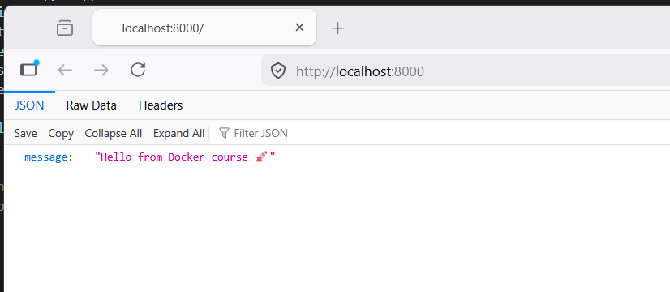

# Demo App

## Run locally (optional)
pip install -r requirements.txt
uvicorn app:app --host 0.0.0.0 --port 8000

## Endpoints
- GET /
- GET /health

## Our Expectation

## DockerFile
gcr.io/distroless/python3-debian12 — this special "runtime-only" base image from Google

## For app_3 
I have added DockerFile and docker-compose.yml